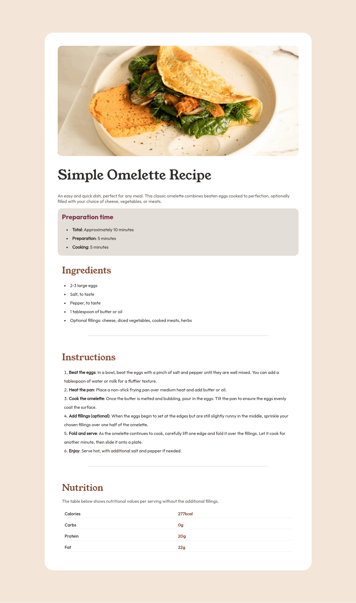
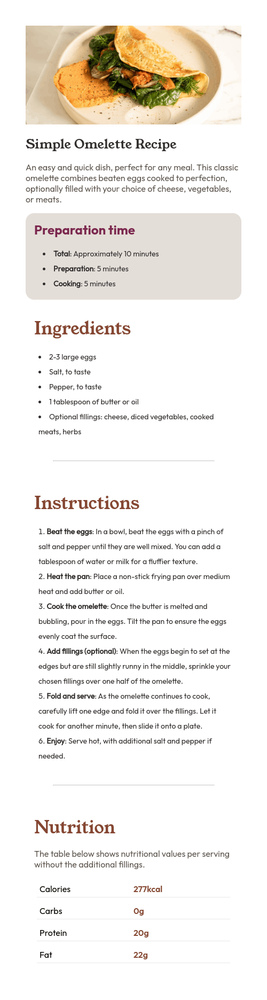

# Frontend Mentor - Recipe page solution

This is a solution to the [Recipe page challenge on Frontend Mentor](https://www.frontendmentor.io/challenges/recipe-page-KiTsR8QQKm). Frontend Mentor challenges help you improve your coding skills by building realistic projects.

## Table of contents

- [Frontend Mentor - Recipe page solution](#frontend-mentor---recipe-page-solution)
  - [Table of contents](#table-of-contents)
  - [Overview](#overview)
    - [Desktop preview](#desktop-preview)
    - [Mobile preview](#mobile-preview)
    - [Links](#links)
  - [My process](#my-process)
    - [Built with](#built-with)
  - [Author](#author)
  - [Acknowledgments](#acknowledgments)

## Overview

### Desktop preview

### Mobile preview

Add a screenshot of your solution. The easiest way to do this is to use Firefox to view your project, right-click the page and select "Take a Screenshot". You can choose either a full-height screenshot or a cropped one based on how long the page is. If it's very long, it might be best to crop it.

Alternatively, you can use a tool like [FireShot](https://getfireshot.com/) to take the screenshot. FireShot has a free option, so you don't need to purchase it.

Then crop/optimize/edit your image however you like, add it to your project, and update the file path in the image above.

**Note: Delete this note and the paragraphs above when you add your screenshot. If you prefer not to add a screenshot, feel free to remove this entire section.**

### Links

- Solution URL: [github/code-beaker/recipe-web-challenge](https://github.com/Code-Beaker/recipe-web-challenge)
- Live Site URL: [Add live site URL here](https://your-live-site-url.com)

## My process

### Built with

- Semantic HTML5 markup
- CSS custom properties
- Flexbox
- CSS Grid
- Mobile-first workflow

## Author

- GitHub - [Code-Beaker](https://www.your-site.com)
- Frontend Mentor - [@Code-Beaker](https://www.frontendmentor.io/profile/Code-Beaker)
- Twitter - [@iamtharunraj](https://www.twitter.com/@iamtharunraj)

## Acknowledgments

I got some help from [MDN Web Docs](https://developer.mozilla.org/en-US/)
